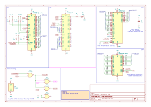

# L7 - Blinking an LED

[Lecture slides link](https://docs.google.com/presentation/d/1XJLBfR6PPP2InueFuBaYFgk0twesn9Tq_KL_dJ2aHF4/edit?usp=sharing)

## Lecture

### The W65C22 Versatile Interface Adapter

## Assignment

### Build

TODO: Picture 

Build the above schematic on the breadboard.
An example board is provided for your reference.

When placing the LED,
make sure that the **shorter leg goes to ground.**
TODO: Picture of LED

### Program

Open up `starter-code/blink.S`.
You just need to fill in the three steps to making the LED blink:
1. Set all pins on port A to be outputs
2. Set all pins on port A to be HIGH
3. Set all pins on port A to be LOW

Each one of the three steps can be done with just `LDA` and `STA`.

Deploy this code to your computer and step through it using the debugger
using the `s` command.

Your LED should turn on and off once every few instructions!

Don't test this program using the `c`ontinue command;
you won't be able to see if the LED is turning on because it will be blinking too fast!

### Troubleshooting

If your flash no longer writes (you can no longer deploy programs),
your VIA may be enabling itself at the wrong time
and causing bus conflicts with the flash.
Use the following steps to debug the issue:

1. Start debugging and use the c`y`cle command to step until the address bus is in the flash range ($8000-$FFFF).
2. Probe the VIA's CS pins. Ensure that either CS1 is LOW or CS2B is HIGH (or both!), i.e. the VIA is disabled.

If you can run the program but your LED doesn't blink, try the following steps.

**Check the PA0 pin** - Use the debugger probe on the PA0 pin directly to check if there's an issue with your LED or if the issue lies in the VIA.

**Observe a write** - Use the c`y`cle command to step through your program
until you are writing to the VIA (i.e. the RWB pin indicates a write).
Then pause and probe each of the pins going into the VIA:
data, register-select, chip-select, RWB, PHI2, and RESB.
Ensure that none of the pins are floating and all of them match up with what you expect.