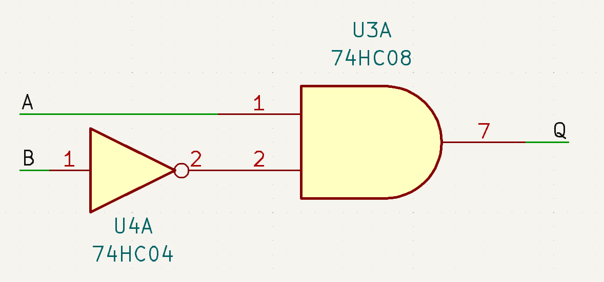
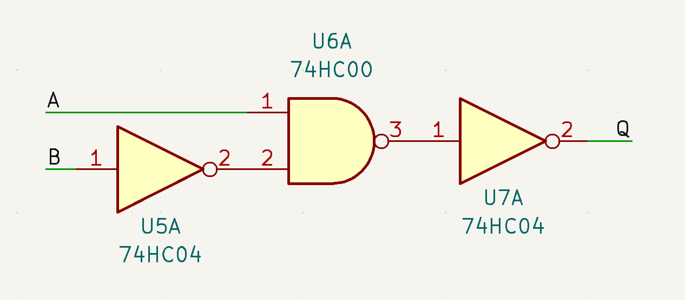
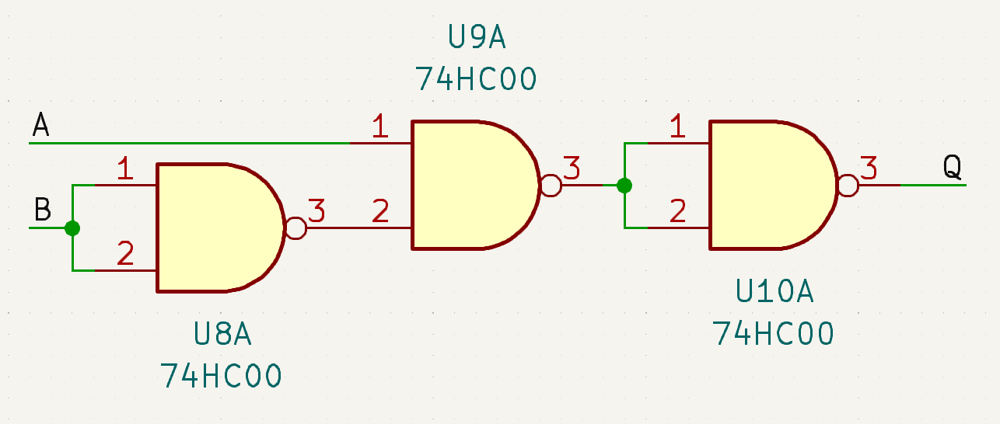
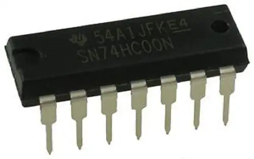
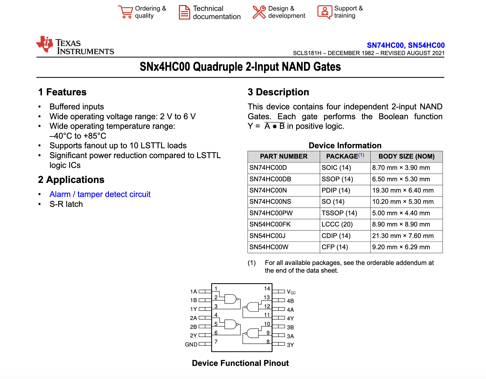
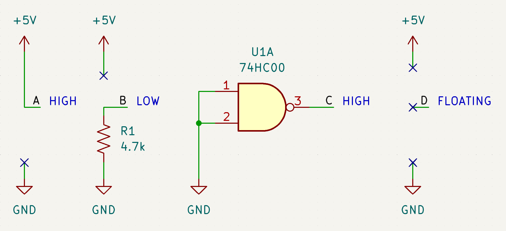
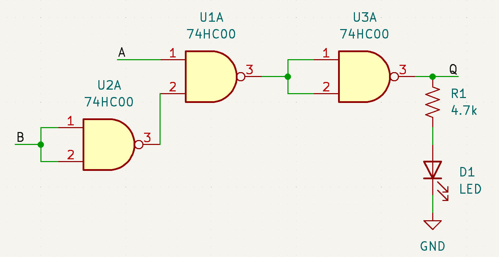

# Electronics Refresher

## Lecture 

### Logic Gates

| A    | NOT A  |
|------|--------|
| abcd | bcdfds |

### Designing Some Logic

Let's say we wanted to implement the following truth table with some logic gates
(where `Q` means our desired output):

| A | B | Q |
|---|---|---|
| 0 | 0 | 0 |
| 0 | 1 | 0 |
| 1 | 0 | 1 |
| 1 | 1 | 0 |

After some contemplation, we could probably deduce that `Q` looks like `A AND NOT B`.
So, if we have some AND gates and some NOT gates laying around, we might implement this as:

However, this is rather inconvenient.
We'd need to wire up two separate kinds of gate (NOT and AND) to do this very simple function.
Furthermore, most logic gate chips come with four or more gates on them,
and the unused gates take up space on the breadboard even if we're not using them.

Let's make some modifications.
First of all, we can recognize that, because AND and NAND are just inverses of each other,
we can replace the AND gate with a NAND followed by a NOT:

Then, we can also replace the NOT gates with NAND gates:

And now we've successfully reduced our logic to only need one kind of gate,
and since the NAND gate IC we'll be using offers four NAND gates per chip,
we only need to use one chip.

### Theory & Practice

When designing or analyzing the behavior of a digital circuit,
keeping extraneous details hidden and keeping wires organized is a good thing.
This is why typically we draw circuits as a **schematic**,
where we use component **symbols** to represent the pieces of the circuit.
The diagrams of the logic gates we used above were schematics.

However, when we go to actually build the circuit using the materials at hand, a number of problems appear.
Most notably: our integrated circuit (IC) doesn't really look much like a NAND gate!

To understand the problem, we need to read the **datasheet** for our IC.
In this case, we're using the 74HC00, whose datasheet is available on [Texas Instruments's Website](https://www.ti.com/lit/ds/symlink/sn74hc00.pdf).

The format (and helpfulness) of a datasheet varies by device and manufacturer,
but typically the information we need is on or near the first page.
For example, we can see the name of the device ("SNx4HC00 Quadruple 2-Input NAND Gates"),
we can see that it works at voltages between 2V and 6V (which is good, because we'll be using 5V),
we can read a brief description of the chip's features,
and most importantly we can find a **pinout diagram** at the bottom.

The pinout diagram reveals to us how the pins on the device function as NAND gates:
each group of three pins is the two inputs and one output of a single gate.
In the bottom left and top right corners are where we supply **power** to the logic gate.

### Power

There are many kinds of transistors and so many kinds of ways to implement digital logic.
This has resulted in a several possible notations for the power pins on ICs, which are mostly interchangable:

**+5V**, **VDD**, and **VCC** all mean the same thing (at least in this class).

**0V**, **VSS**, and **GND** also all mean the same thing (at least in this class).

Any time any of the above pins appears on an IC's datasheet,
you should always make sure that you remember to connect them to the appropriate power supply.

### Logic Levels 

Up until now we've been discussing logic in terms of 1 and 0, but we all know that math isn't real.
You can't send a number across a wire–you send a **voltage**!

If we charge a wire to a HIGH voltage (in our case, above about 4.5V), we usually *interpret* that wire as meaning "1".

If we charge a wire to a LOW voltage (in our case, below about 0.5V), we usually *interpret* that wire as meaning "0".

Any voltage in-between HIGH and LOW is meaningless,
and most gates aren't designed to work correctly with voltages in the middle.

Often, HIGH=1 and LOW=0 is good enough, but we'll encounter some situations later on where the meaning of "1" and "0"
isn't clear, and so we'll use HIGH and LOW from now on and develop some better words to describe the meaning of signals later.

For the purposes of this class, we will assume that a HIGH signal means the same thing as 5V,
and assume that a LOW signal means the same thing as 0V.

### Floating Wires

In theory, any wire in a circuit should always be either HIGH, or LOW.
This is because we try to design our circuits so that all the wires are always
"driven" (strongly) or "pulled" (weakly) to be HIGH or LOW.

For example, if a wire is connected directly to the 5V/GND rail,
we say that it is *driven* (or sometimes "tied", since it's just a wire) HIGH/LOW.

The *output* of a logic gate is always strong, so it drives signals, unless specifically noted otherwise.

If a wire is connected to (for example) the 5V/GND rail through a resistor,
we say that it is *pulled* HIGH/LOW.
By itself, this behaves the same as driving the wire HIGH/LOW;
but the distinction becomes important later when we start mixing driving and pulling.

The diagram below shows an example setup.
Wire A is being driven HIGH, wire B is being pulled LOW, and wire C is being driven HIGH.

What is very important is what happens if a wire isn't being driven or pulled at all:
we say that the wire is **floating**, because it isn't (electrically) connected to a known voltage.
In the above diagram, wire D is floating.
Floating wires are almost always bad in digital circuits because,
depending on your luck, they will switch between HIGH, LOW, and somewhere inbetween seemingly at random.
Not only does this produce difficult-to-debug issues,
but many logic gates will heat up and destroy themselves if they receive an input halfway between HIGH and LOW for too long.

In other words: wire's haunted.

TODO: Why do floating wires behave so erratically?

### The Probe

Unfortunately, tools like multimeters are ill-suited to finding out if a wire is floating.
If you try to measure a floating wire's voltage with a multimeter,
it will often say 0V due to imperfections inside the meter–in other words, we can't distinguish LOW and floating!

Fortunately, you have another means of checking your wires for floatiness: the probe.
When the green light is on, the signal is HIGH.
When the red light is on, the signal is LOW.
If both lights or neither light is on, or the lights are dim, the signal is floating.

TODO: Insert image

The #1 cause of inconsistent behavior in breadboard circuits is because of floating wires,
so always make sure you poke your wires and ensure they are being driven!

## Hands-On Section

### New Materials

- Breadboard
- Breadboard Wire Kit
- Male-to-Male Jumper Wires
- 74HC00 4x 2-input NAND Gate
- Debugger PCB
- LED
- Resistor

### Assignment

Build the following logic, which implements "A and not B", on a breadboard.
The debugger should be attached and used for power and for "THE PROBE."

The power rails should be connected to 5V/GND respectively, since they'll be needed later.
Always turn off the power on the debugger when changing wiring,
then turn the power on and **check each part of the circuit** using the probe.

Common problems include:

**Power** - Make sure the debugger is turned on and plugged in (it has a power LED).

**Power Rails** - All 4 power rails should be in the correct state (either HIGH or LOW).

**Wrongly-Bent Pins** - The NAND gate's pins should go into the breadboard holes
that are directly straddling the gap in the center. If the pins are bent too far outwards,
try gently rolling the NAND gate against the table on both sides evenly to bend the pins closer together.

**Pinouts** - The [74HC00 datasheet](https://www.ti.com/lit/ds/symlink/sn74hc00.pdf)
shows how the NAND gates are laid out inside the chip.
Note that the side of the chip with the indent is always the top.

**Logic Inputs** - The A and B inputs should always be connected to either 5V or GND, never floating.

**NAND Gate Power** - Always ensure that the NAND gate's VDD and VSS pins are connected to 5V and GND,
respectively.

**NAND Gate Outputs** - The output of each NAND gate should always be HIGH or LOW.
If they are floating, then typically the pinout is wrong or the NAND gate isn't powered.